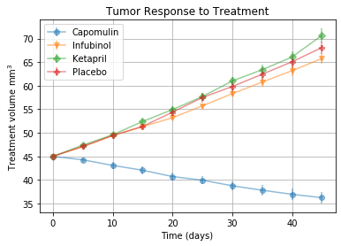
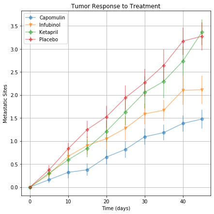
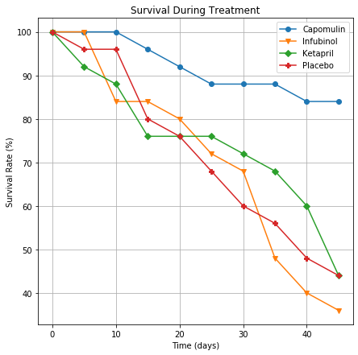
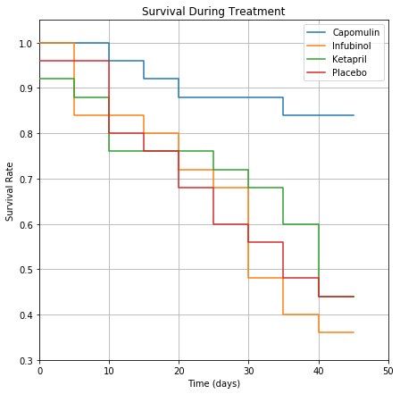
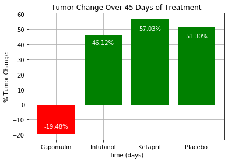

# Matplotlib challenge

## Description

The folder Pymaceuticals contains a notebook document for Jupyter Notebook.  It expects two csv files in a subdirectory data, clinicaltrial_data.csv and mouse_drug_data.csv.  Sample contents of these files are below.

### clinicaltrial_data.csv

| Mouse ID | Timepoint | Tumor Volume (mm3) | Metastatic Sites |
|:--------:|:---------:|:------------------:|------------------|
|   b128   |     0     |         45         | 0                |
| f932     | 0         | 45                 | 0                |
| g107     | 0         | 45                 | 0                | 

### mouse_drug_data.csv

| Mouse ID |   Drug   |
|:--------:|:--------:|
|   f234   | Stelasyn |
| x402     | Stelasyn |
| a492     | Stelasyn |

An analysis is done on the four treatments, namely, Capomulin, Infubinol, Ketapril, and Placebo.  The notebook creates and saves the following plots as png files in the Images subfolder, which may be also be viewed below.

* A scatter plot showing tumor volume changes over time for each treatment.
* A scatter plot showing the number of metastic sites over time for each treatment.
* A scatter plot that shows the number of mice still alive through the course of treatment (Survival Rate) and a Kaplan-Meier 
* A bar graph that compares the total % tumor volume change for each treatment across the full 45 days.

## Observations

1. Capomulin is the most promissing of the the four treatments analyzed.  It reduced tumor volume the most, had fewer metastic sites, and had the highest survival rate.  
2. Since the error bars for Capomulin were below those of the other treatments in the tumor volume and metastic site plots, it is likely that these are statistically signifigant differences in the mouse treatment groups.
3. Infubinol gave somewhat better results than the Placebo in reducing tumor size and metastic sites, however, its survival rate was lower than a Placebo indicating it may have potentially dangerous side effect(s).  
4. There was very little difference between Ketapril and the Placebo.  

## Plots

### Tumor volume changes over time for each treatment

### Number of metastic sites over time for each treatment

### Survival plots

### Bar graph of tumor volume

